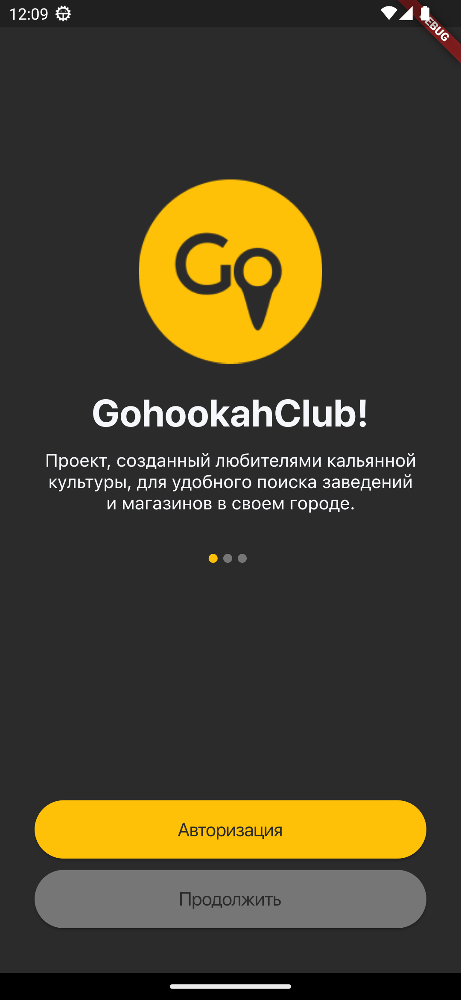
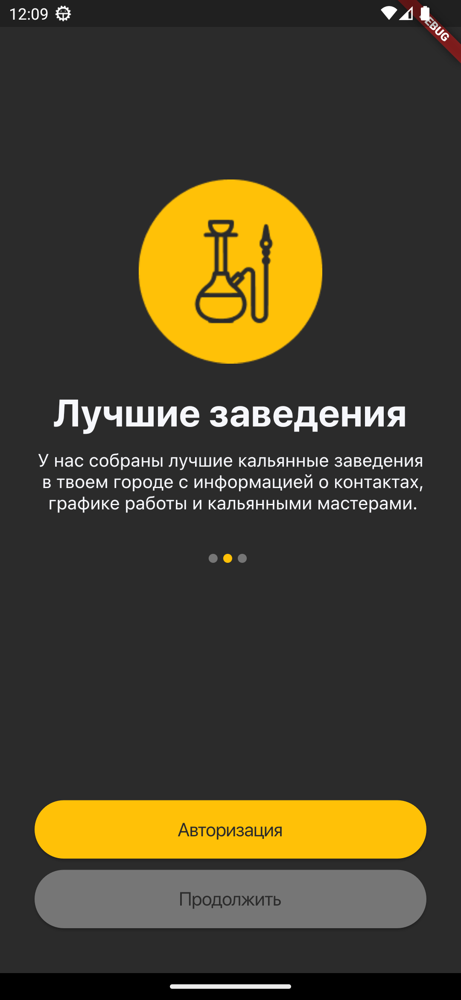
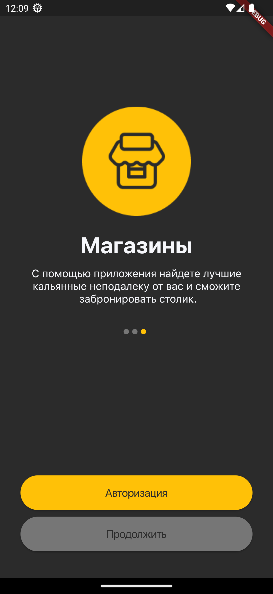
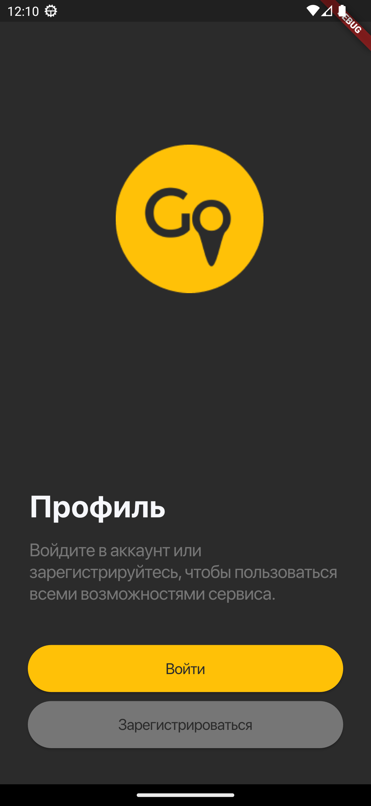
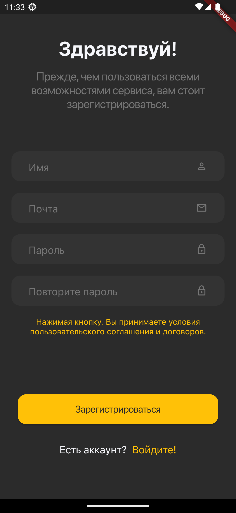

# GoHookah-Network.

This application was written in the studio. Initially, it was as an application for an internship, where they could evaluate my knowledge. Subsequently, when they saw, that I could write the application, they found investors, and the application went from a test version to a commercial one.

After, I left the studio, had limited access to the previously written and did not have the source code. In this repository I am trying to at least some part of the past application, but without affecting the copyrights.

## Getting Started.

This project is a starting point for a Flutter application.

How do I start it up?

Terminal:

```
- gh repo clone eextjcxltuires/GoHookah-Network.
```

IDE VS Code:

```
file, pubspec.yaml:

- flutter pub get packages.
```

```
file, main.dart:

- flutter run.
```

### Review.

<table>
  <tr>
    <td>Welcome Page - 1.</td>
    <td>Welcome Page - 2.</td>
    <td>Welcome Page - 3.</td>
  </tr>
  <tr>
    <td></td>
    <td></td>
    <td></td>
  </tr>
 </table>

<table>
  <tr>
    <td>Authorization Page.</td>
    <td>Login Page.</td>
    <td>Registration Page.</td>
  </tr>
  <tr>
    <td></td>
    <td></td>
    <td></td>
  </tr>
 </table>
