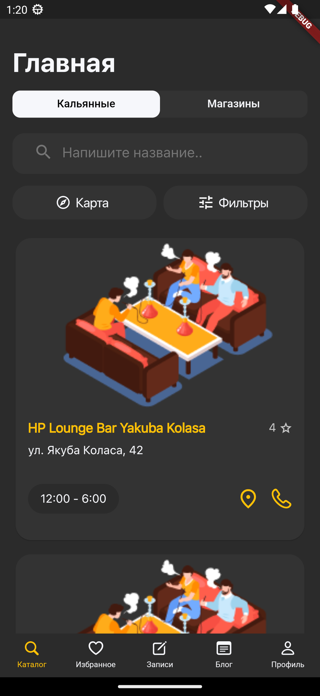
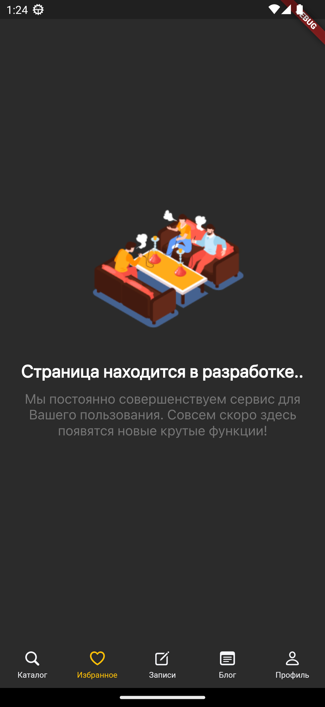

# GoHookah-Network.

This application was written in the studio. Initially it was for an internship, where they could evaluate my knowledge. Subsequently, when they saw that I could write the application, they found investors, and the application went from a test version to a commercial one.

Afterwards, I left the studio, had limited access to what I had previously written, and had no source code. In this repository, I am trying to at least partially restore the past app, but without affecting the copyright.


There is no authorization with authentication, and some pages are missing. On top of that, the data used to come from the server and was connected: database, caching.

## Getting Started.

This project is a starting point for a Flutter application.

How do I start it up?

Terminal:

```
- gh repo clone eextjcxltuires/GoHookah-Network.
```

IDE VS Code:

```
file, pubspec.yaml:

- flutter pub get packages.
```

```
file, main.dart:

- flutter run.
```

### Review.

Welcome pages. Are shown, when the application is first opened.

<table>
  <tr>
    <td>Welcome 1.</td>
    <td>Welcome 2.</td>
    <td>Welcome 3.</td>
  </tr>
  <tr>
    <td></td>
    <td></td>
    <td></td>
  </tr>
 </table>

Authorization, and authentication pages.

<table>
  <tr>
    <td>Authorization.</td>
    <td>Login.</td>
    <td>Registration.</td>
  </tr>
  <tr>
    <td></td>
    <td></td>
    <td></td>
  </tr>
 </table>

Catalog page: a list of places, and detailed pages (hookah place, store).

<table>
  <tr>
    <td>Place.</td>
    <td>Store.</td>
  </tr>
  <tr>
    <td></td>
    <td></td>
  </tr>
 </table>

<table>
  <tr>
    <td>Detail: Place 1.</td>
    <td>Detail: Place 2.</td>
  </tr>
  <tr>
    <td></td>
    <td></td>
  </tr>
 </table>

<table>
  <tr>
    <td>Detail: Store 1.</td>
    <td>Detail: Store 2.</td>
  </tr>
  <tr>
    <td></td>
    <td></td>
  </tr>
 </table>

Any other pages or, sections on the page (for example: maps, filter).

<table>
  <tr>
    <td>Development.</td>
  </tr>
  <tr>
    <td></td>
  </tr>
 </table>
